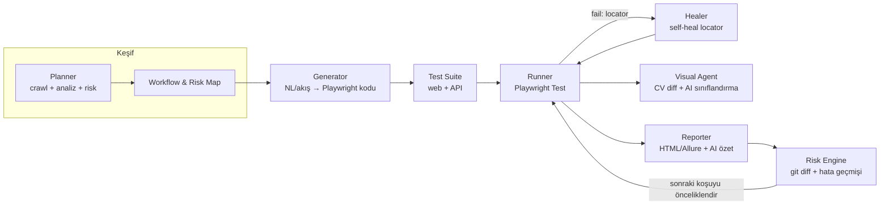

# qa-agent — AI Destekli QA Test Otomasyon Framework'ü

> **Çalışma adı:** `qa-agent` (yer tutucu — bkz. [Açık Kararlar](#15-açık-kararlar-furkana))
> **Vizyon:** Selenium kırılganlığından kurtulmuş, ISTQB mantığında, farklı şirket/projelere kolayca uyarlanabilen, doğal dilden test üretebilen, kendi locator'larını onaran ve CI/CD'ye gömülebilen **"kıdemli test mühendisi gibi davranan"** bir açık kaynak framework.
>
> **Stack:** TypeScript / Node.js · **Çekirdek:** Playwright · **Şekil:** CLI + npm kütüphanesi · **v1 kapsam:** Web + API (mobil-web responsive dahil)

Bu doküman bir AI kodlama ajanına (Codex, Claude, Copilot vb.) verilmek üzere yazılmıştır. Hem **ürün gereksinimleri (PRD)** hem **mimari spesifikasyon** hem de **build talimatları** içerir.

---

## İçindekiler

1. [Problem ve Hedefler](#1-problem-ve-hedefler)
2. [Kapsam ve Kapsam Dışı](#2-kapsam-ve-kapsam-dışı)
3. [Hedef Kullanıcılar ve Senaryolar](#3-hedef-kullanıcılar-ve-senaryolar)
4. [Mimari Genel Bakış (Ajan Döngüsü)](#4-mimari-genel-bakış-ajan-döngüsü)
5. [ISTQB Eşleşmesi (Farklılaştırıcı)](#5-istqb-eşleşmesi-farklılaştırıcı)
6. [Teknik Stack](#6-teknik-stack)
7. [Proje Yapısı](#7-proje-yapısı)
8. [Modül Spesifikasyonları](#8-modül-spesifikasyonları)
9. [Konfigürasyon (Çok Projeli Uyarlanabilirlik)](#9-konfigürasyon-çok-projeli-uyarlanabilirlik)
10. [CLI Komutları](#10-cli-komutları)
11. [CI/CD Entegrasyonu](#11-cicd-entegrasyonu)
12. [Örnek Akışlar](#12-örnek-akışlar)
13. [Yol Haritası (Fazlar)](#13-yol-haritası-fazlar)
14. [OSS Kurulumu (Codex for OSS Başvurusu İçin)](#14-oss-kurulumu-codex-for-oss-başvurusu-için)
15. [Açık Kararlar (Furkan'a)](#15-açık-kararlar-furkana)

---

## 1. Problem ve Hedefler

**Problem:** Geleneksel test otomasyonu (özellikle Selenium) kırılgandır. UI'da küçük bir değişiklik onlarca testi kırar; bakım maliyeti testin kendi değerini aşar. Test yazmak uzmanlık ister, her şirket sıfırdan kurar. CI'da her seferinde binlerce test koşturmak yavaştır.

**Hedefler:**

- **Kırılganlığı azalt:** Kullanıcı odaklı locator'lar (role/label/text/test-id) + self-healing katmanı.
- **Üretkenlik:** Doğal dil isteminden veya kullanıcı akışından otomatik Playwright testi üret.
- **Keşif:** Uygulamayı tarayıp (crawl) yeni iş akışlarını, formları, menüleri otomatik bul → "pesticide paradox"u kır (hep aynı testler yeni bug bulamaz).
- **Akıllı seçim:** Her koşuda her şeyi değil; kod değişikliği + geçmiş hata geçmişine göre riskli testleri öncelikle koştur (risk-based testing).
- **Görsel doğrulama:** Computer vision ile sürümler arası UI farklarını yakala (hizalama, eksik ikon, layout bozulması).
- **Uyarlanabilirlik:** Tek bir config dosyasıyla yeni bir şirkete/projeye dakikalar içinde adapte ol.
- **ISTQB hizası:** Üretilen her test; test seviyesi, türü, tasarım tekniği ve risk skoruyla etiketlensin; izlenebilirlik (traceability) matrisi çıksın.
- **CI/CD-native:** GitHub Actions, Docker, paralel sharding, standart raporlar (HTML/Allure/JUnit XML).
- **Sağlayıcı bağımsızlığı:** OpenAI varsayılan, ama Anthropic / yerel model (Ollama) takılabilsin.

---

## 2. Kapsam ve Kapsam Dışı

**v1 kapsamında:**
- Web UI testleri (Playwright, Chromium/Firefox/WebKit)
- Mobil-web / responsive testleri (Playwright device emülasyonu)
- API testleri (Playwright `request` fixture)
- Doğal dil → test üretimi
- Self-healing locator
- Risk tabanlı test seçimi (git diff + geçmiş)
- Görsel regresyon (CV + opsiyonel AI sınıflandırma)
- CLI + npm kütüphanesi

**Kapsam dışı (roadmap'te):**
- Native mobil (Appium) → Faz 4
- Tam SaaS platformu / multi-tenant dashboard → ayrı ürün
- Performans/yük testi (k6 entegrasyonu) → Faz 4+
- Self-hosted bulut koşum altyapısı

---

## 3. Hedef Kullanıcılar ve Senaryolar

- **QA mühendisi:** "Login akışını test et" yazar, framework çalışır testi üretir; UI değişince test kendini onarır.
- **Geliştirici (CI):** PR açar; framework sadece etkilenen modüllerin testlerini koşturur, hızlı feedback verir.
- **QA lead / ISTQB takımı:** İzlenebilirlik matrisi, risk skorları ve test tasarım tekniği kapsamı raporu alır.
- **Ajansy/danışman (örn. çoklu müşteri):** Her müşteri için `qa.config.ts` ile dakikalar içinde yeni kurulum.

---

## 4. Mimari Genel Bakış (Ajan Döngüsü)

Sürekli bir test döngüsü: **Planner → Generator → Runner → Healer/Visual → Reporter → Risk Engine** ve baştan.



**Ajanların özeti:**

| Ajan | Girdi | Çıktı | Çekirdek teknik |
|------|-------|-------|-----------------|
| **Planner** | URL + (ops.) açıklama | Workflow grafiği + risk haritası | Crawl + accessibility tree + LLM reasoning |
| **Generator** | NL prompt / kayıtlı akış | Playwright test + Page Object | LLM + role-based locator şablonları |
| **Healer** | Başarısız locator + güncel DOM | Onarılmış locator / PR önerisi | a11y snapshot + LLM eşleştirme + locator geçmişi |
| **Visual** | Ekran görüntüleri (baseline vs current) | Anlamlı/gürültü diff sınıflandırması | pixelmatch/odiff + LLM vision |
| **Risk Engine** | git diff + run history | Önceliklendirilmiş test listesi | Test impact analizi + flakiness skoru |

> **Tasarım ilkesi:** Ekran görüntüsü yerine mümkünse **accessibility tree / DOM snapshot** kullan (LLM için daha ucuz, daha kararlı). Görüntü sadece görsel doğrulama ve gerekli durumlarda.

---

## 5. ISTQB Eşleşmesi (Farklılaştırıcı)

Bu, projeyi "yine bir AI test aracı"ndan ayıran şey. Framework, ISTQB Foundation kavramlarını **birinci sınıf vatandaş** yapar:

- **Test seviyeleri:** Üretilen testler etiketlenir → component / integration / system / acceptance.
- **Test türleri:** functional / non-functional / change-related (regression & confirmation).
- **Black-box tasarım teknikleri** (Generator/Planner bunları uygular):
  - Equivalence Partitioning (EP)
  - Boundary Value Analysis (BVA) — input alanları için sınır değerleri otomatik üret
  - Decision Table
  - State Transition
  - Use Case testing
- **Risk-based testing:** `risk = olasılık × etki`. Risk Engine bunu formel olarak uygular.
- **Test süreci aktiviteleri:** planning → analysis → design → implementation → execution → completion; CLI komutları bu aşamalara karşılık gelir.
- **İzlenebilirlik (traceability):** requirement/feature ID → test case ID → koşum sonucu. Rapora traceability matrisi eklenir.
- **7 test prensibi** narrative olarak dokümana ve davranışa yansır (örn. "exhaustive testing impossible" → risk tabanlı seçim; "pesticide paradox" → Planner ile sürekli yeni akış keşfi).

**Uygulama:** Her test dosyasının başına yapılandırılmış metadata bloğu:

```ts
/** @istqb
 * level: system
 * type: functional
 * technique: [BVA, EP]
 * risk: high
 * requirement: REQ-AUTH-001
 */
```

Bu metadata raporlarda toplanır → ISTQB uyumlu kapsam ve izlenebilirlik çıktısı.

---

## 6. Teknik Stack

| Katman | Seçim | Not |
|--------|-------|-----|
| Dil | TypeScript (strict) | Tüm paketler |
| Test çekirdeği | `@playwright/test` | Web + API (`request` fixture) + trace viewer + paralel |
| Runtime/PM | Node.js 20+ / **pnpm workspace** | Monorepo değil, hafif workspace |
| LLM soyutlama | **Vercel AI SDK** (`ai`) veya ince custom `LLMProvider` arayüzü | Sağlayıcı-bağımsız (OpenAI/Anthropic/Ollama) |
| Crawl/keşif | Playwright + accessibility tree | (Ops. Microsoft **Playwright MCP** referans alınabilir) |
| Görsel diff | `pixelmatch` veya `odiff` + Playwright `toHaveScreenshot()` | AI sınıflandırma için LLM vision |
| CLI | `commander` veya `clipanion` + `prompts` | |
| Config | `qa.config.ts` (TS, tip güvenli) + zod doğrulama | |
| Raporlama | Playwright HTML report + **Allure** + JUnit XML + custom AI özet | |
| Test impact | `git diff` parse + bağımlılık/tag haritası + flakiness store | |
| Depolama | Yerel JSON/SQLite (run history, locator store) | DB zorunlu değil |
| Lint/format | ESLint + Prettier | |
| Birim test | **Vitest** | Framework'ün kendi testleri |
| Build | `tsup` veya `tsc` | npm publish için |
| Container | Docker (Playwright base image) | CI için |

> **Önemli:** Model isimlerini (`gpt-...`, `claude-...`) config'de **çevre değişkeniyle** belirt ve sürümleri pinle; doküman içine sabit model adı gömme.

---

## 7. Proje Yapısı

```
qa-agent/
├─ packages/
│  ├─ core/            # engine, config loader, browser/session, ortak tipler
│  ├─ providers/       # LLMProvider arayüzü + openai/anthropic/ollama impl.
│  ├─ agents/
│  │  ├─ planner/      # crawler + workflow/risk keşfi
│  │  ├─ generator/    # NL/akış → Playwright kod üretimi
│  │  ├─ healer/       # self-healing locator
│  │  └─ visual/       # CV diff + AI sınıflandırma
│  ├─ risk/            # test impact analizi + önceliklendirme
│  ├─ reporters/       # allure + AI özet reporter
│  ├─ mcp/             # MCP server (AI ajanlarına framework'ü aç) — Faz 3
│  └─ cli/             # `qa-agent` CLI (tüm komutlar)
├─ examples/
│  └─ demo-app/        # framework'ü gösteren örnek proje + demo GIF
├─ templates/          # POM, fixture, config şablonları (init için)
├─ docs/               # VitePress/Docusaurus dokümanı
├─ .github/
│  ├─ workflows/ci.yml
│  ├─ ISSUE_TEMPLATE/
│  └─ PULL_REQUEST_TEMPLATE.md
├─ Dockerfile
├─ AGENTS.md           # AI kodlama ajanı için talimatlar (bkz. §14)
├─ README.md
├─ CONTRIBUTING.md
├─ CODE_OF_CONDUCT.md
├─ SECURITY.md
├─ LICENSE             # MIT
├─ CHANGELOG.md        # changesets ile otomatik
├─ package.json
├─ pnpm-workspace.yaml
└─ tsconfig.base.json
```

---

## 8. Modül Spesifikasyonları

### 8.1 `core`
- `defineConfig()` — tip güvenli config tanımı; zod ile runtime doğrulama.
- `Session` — Playwright browser/context yaşam döngüsü, auth state yönetimi.
- Ortak tipler: `Workflow`, `TestArtifact`, `Locator`, `RunResult`, `RiskScore`, `IstqbMeta`.

### 8.2 `providers`
```ts
export interface LLMProvider {
  name: string;
  complete(input: { system?: string; prompt: string; schema?: ZodSchema }): Promise<string | object>;
  vision?(input: { prompt: string; images: Buffer[] }): Promise<string>;
}
```
- `OpenAIProvider`, `AnthropicProvider`, `OllamaProvider`.
- Config'teki `ai.provider` + `ai.fallback` ile seçim ve otomatik fallback.
- Structured output: LLM'den **sadece JSON** iste, zod ile parse et.

### 8.3 `agents/planner`
- Hedef URL'den başlar, sayfaları gezer (BFS), her sayfanın accessibility tree'sini alır.
- Formları, butonları, navigasyon menülerini, olası kullanıcı akışlarını tespit eder.
- LLM ile her akışa **risk skoru** ve **ISTQB metadata** atar.
- Çıktı: `workflows.json` (akış grafiği + risk haritası).
- Güvenlik: yalnızca config'te izin verilen domain/path'lerde gezinir (allowlist).

### 8.4 `agents/generator`
- Girdi: doğal dil prompt **veya** Planner akışı **veya** Playwright codegen kaydı.
- Çıktı: `*.spec.ts` test dosyası + (gerekirse) Page Object Model.
- Locator stratejisi: **önce** `getByRole`/`getByLabel`/`getByText`/`getByTestId`; XPath/CSS son çare.
- ISTQB tekniklerini uygular (BVA için sınır değer setleri vb.).
- Üretilen koda `@istqb` metadata bloğu ekler.

### 8.5 `agents/healer`
- Bir locator runtime'da bulunamadığında tetiklenir.
- Güncel a11y snapshot'ı alır, LLM'e "eski locator buydu, şimdi karşılığı ne?" diye sorar.
- `locator-store.json`'da locator geçmişini tutar; benzerlik skoruyla en olası eşleşmeyi seçer.
- Modlar: `auto` (testi düzeltip devam) / `suggest` (PR önerisi oluştur, insan onaylar).
- Onarımları rapora "healed" olarak işaretler (sessiz onarım yapma — şeffaflık).

### 8.6 `agents/visual`
- Playwright `toHaveScreenshot()` ile baseline yakala/karşılaştır.
- Piksel farkı `pixelmatch`/`odiff` ile; eşik config'ten.
- Fark varsa LLM vision'a sor: "Bu anlamlı bir regresyon mu, yoksa gürültü/anti-aliasing mi?" → false-positive azalt.
- Çıktı: diff görselleri + sınıflandırma + rapora ek.

### 8.7 `risk`
- `git diff` (son commit / PR base) → değişen dosyalar.
- Dosya → test eşlemesi (tag/import grafiği veya manuel `risk.map`).
- `run-history.json`'dan flakiness ve son hata sıklığı.
- Skor: `priority = w1·changeImpact + w2·historicalFailure + w3·businessRisk`.
- `qa-agent run --changed` bu listeyi kullanır.

### 8.8 `reporters`
- Playwright HTML + Allure + JUnit XML.
- **AI özet reporter:** başarısız testleri LLM'e verip kök neden tahmini + kısa özet üretir.
- ISTQB izlenebilirlik matrisi çıktısı (requirement → test → sonuç).

### 8.9 `cli`
- Tüm komutları orkestre eder (bkz. §10).

### 8.10 `mcp` (Faz 3)
- Framework'ü bir **MCP server** olarak expose et → Codex/Claude/Cursor doğrudan "test üret/koş/onar" diyebilsin.

---

## 9. Konfigürasyon (Çok Projeli Uyarlanabilirlik)

Tek dosya ile yeni şirkete adapte olmanın anahtarı:

```ts
// qa.config.ts
import { defineConfig } from "@qa-agent/core";

export default defineConfig({
  project: { name: "musteri-adi", owner: "qratix" },

  targets: {
    web: {
      baseUrl: process.env.WEB_BASE_URL!,
      browsers: ["chromium"],
      devices: ["Desktop Chrome", "iPhone 14"], // responsive/mobil-web
      allowlist: ["app.example.com"],            // Planner sadece burada gezer
    },
    api: {
      baseUrl: process.env.API_BASE_URL!,
      auth: { type: "bearer", tokenEnv: "API_TOKEN" },
    },
  },

  ai: {
    provider: "openai",            // openai | anthropic | ollama
    model: process.env.AI_MODEL!,  // sürümü env'den pinle
    apiKeyEnv: "OPENAI_API_KEY",
    fallback: { provider: "anthropic", model: process.env.AI_FALLBACK_MODEL },
  },

  locators: { strategy: ["role", "label", "testId", "text"], selfHeal: "suggest" },
  visual:   { enabled: true, threshold: 0.2, aiClassify: true },
  risk:     { strategy: "git-diff+history", minPriority: "medium" },

  istqb: {
    traceability: true,
    techniques: ["BVA", "EP", "decision-table", "state-transition"],
  },
});
```

> Yeni müşteri = yeni `qa.config.ts` + env değişkenleri. Kod değişmez.

---

## 10. CLI Komutları

| Komut | İş | ISTQB aşaması |
|-------|----|----|
| `qa-agent init` | Yeni hedef için config + klasör iskeleti oluştur | Planning |
| `qa-agent explore [--url ...]` | Planner: uygulamayı tara, `workflows.json` üret | Analysis |
| `qa-agent generate "<prompt>"` | NL'den test üret | Design |
| `qa-agent generate --from-flow rec.json` | Kayıtlı akıştan test üret | Design |
| `qa-agent run [--changed] [--risk high] [--shard k/n]` | Testleri koştur (risk filtreli) | Execution |
| `qa-agent heal [--mode auto\|suggest]` | Başarısız locator'ları onar | Maintenance |
| `qa-agent visual [--update]` | Görsel baseline/karşılaştırma | Execution |
| `qa-agent report` | HTML/Allure + AI özet + traceability | Completion |
| `qa-agent mcp` | MCP server başlat (Faz 3) | — |

---

## 11. CI/CD Entegrasyonu

`.github/workflows/ci.yml` (taslak mantık):

```yaml
name: qa
on: [pull_request]
jobs:
  test:
    runs-on: ubuntu-latest
    strategy:
      matrix: { shard: [1, 2, 3, 4] }
    steps:
      - uses: actions/checkout@v4
        with: { fetch-depth: 0 }   # git diff için tüm geçmiş
      - uses: actions/setup-node@v4
        with: { node-version: 20 }
      - run: pnpm install
      - run: pnpm exec playwright install --with-deps
      - run: pnpm qa-agent run --changed --shard ${{ matrix.shard }}/4
        env:
          OPENAI_API_KEY: ${{ secrets.OPENAI_API_KEY }}
      - uses: actions/upload-artifact@v4
        if: always()
        with: { name: report-${{ matrix.shard }}, path: ./report }
```

- `--changed` → sadece PR'da etkilenen testler (hız + güven dengesi).
- Trace + HTML rapor artifact olarak yüklenir.
- Docker image ile lokal/CI tutarlılığı.

---

## 12. Örnek Akışlar

**A) Doğal dilden test:**
```bash
qa-agent generate "Kullanıcı geçerli e-posta ve şifreyle login olabilmeli; \
boş şifrede hata mesajı görmeli (BVA + EP uygula)"
# → tests/auth/login.spec.ts üretir, role-based locator + @istqb metadata ile
```

**B) Keşif + öncelik:**
```bash
qa-agent explore --url https://app.example.com   # workflows.json + risk haritası
qa-agent run --risk high                          # sadece yüksek riskli akışlar
```

**C) Self-healing:**
```
Runner: locator `getByRole('button', { name: 'Giriş' })` bulunamadı.
Healer: a11y snapshot alındı → en olası eşleşme `getByRole('button', { name: 'Oturum Aç' })` (0.92 skor).
Mod=suggest → PR #42 açıldı: "fix(locator): login button text changed".
```

**D) Görsel:**
```bash
qa-agent visual --update      # baseline
# sonraki koşuda: layout kayması tespit → AI: "anlamlı regresyon (header overlap)"
```

---

## 13. Yol Haritası (Fazlar)

| Faz | İçerik | Çıktı |
|-----|--------|-------|
| **0 — MVP** | core + config + providers + generator (NL→web) + runner + HTML report | Çalışan demo, `examples/demo-app` |
| **1 — Yayın** | API testleri + self-healing + tam CLI + GitHub Action + docs + OSS dosyaları | **npm publish** → **Codex for OSS başvurusu** |
| **2 — Zeka** | Planner (crawl+keşif) + Risk Engine + Visual (CV + AI sınıflandırma) | "Akıllı" döngü tam çalışır |
| **3 — Ekosistem** | MCP server + Allure + traceability raporu + plugin API | AI ajanlarıyla entegrasyon |
| **4 — Genişleme** | Native mobil (Appium) + ek sağlayıcılar + performans (k6) | Çok kanallı test |

> **Strateji:** Faz 1 biter bitmez yayınla ve başvur. Başvuru gücü, **gerçek kullanım + iyi dokümantasyon + net değer**den gelir.

---

## 14. OSS Kurulumu (Codex for OSS Başvurusu İçin)

OpenAI Codex for OSS programı katı yıldız eşiği koymuyor; **ekosistem önemi, gerçek kullanım ve aktif bakım** sinyallerine bakıyor ve "sırf başvurmak için boş repo açma" diye açıkça uyarıyor. Yani strateji = **gerçekten kullanılabilir, iyi paketlenmiş bir araç**. Gerekli dosyalar:

- `LICENSE` — **MIT** (en geniş adoption).
- `README.md` — net değer önermesi, 60 saniyelik quickstart, demo GIF/asciinema, badge'ler (npm, CI, license).
- `CONTRIBUTING.md`, `CODE_OF_CONDUCT.md`, `SECURITY.md`.
- `.github/ISSUE_TEMPLATE/` + `PULL_REQUEST_TEMPLATE.md`.
- **Conventional Commits** + **changesets** → otomatik `CHANGELOG` ve semver.
- `docs/` (VitePress) — kurulum, kavramlar, ISTQB eşlemesi, örnekler.
- Framework'ün **kendi testleri** (Vitest) + yeşil CI badge.
- **npm'de yayınla** (`@qa-agent/cli`) — aylık indirme = adoption sinyali.
- GitHub: iyi açıklama + topics (`playwright`, `ai`, `test-automation`, `qa`, `istqb`, `self-healing`).
- Gerçek bir örnek kullanım (örn. `examples/demo-app`) ve mümkünse 1-2 dış kullanıcı/issue.

**Başvuru metni için hazırla:** projenin ne çözdüğü, kimin kullandığı, Codex/API kredisini OSS bakımında (PR review, test üretimi, release otomasyonu) nasıl kullanacağın — net ve abartısız.

### `AGENTS.md` (AI kodlama ajanı bu dosyayı okur)

Repoya şu içerikle bir `AGENTS.md` ekle:

```markdown
# AGENTS.md

## Build & Test
- pnpm install
- pnpm build      # tüm paketleri derle
- pnpm test       # Vitest birim testleri
- pnpm lint       # ESLint + Prettier
- pnpm e2e        # framework'ün kendi e2e demosu

## Konvansiyonlar
- TypeScript strict; `any` yasak.
- Locator kuralı: önce getByRole/getByLabel/getByText/getByTestId; XPath son çare.
- Her üretilen teste @istqb metadata bloğu zorunlu.
- Conventional Commits (feat:, fix:, docs:, chore: ...).
- Sır/anahtar commit etme; her şey env üzerinden.

## Yeni sağlayıcı eklerken
- providers/ altında LLMProvider arayüzünü implemente et + test yaz.

## Yeni ajan eklerken
- agents/<isim>/ altında; core tiplerini kullan; reporter'a entegre et.
```

---

## 15. Açık Kararlar (Furkan'a)

Build'e başlamadan netleştirilmesi iyi olan küçük kararlar:

1. **İsim/marka:** `qa-agent` yer tutucu. Markan `qratix` olduğu için örn. `qratix-qa`, `qaforge`, `testwright`, `sentinel-qa` gibi alternatifler — npm'de boş mu kontrol et. (Not: `auto-playwright`, `shortest`, `midscene`, `zerostep` gibi benzer araçlar var; farkın **ISTQB + tam döngü + çok-proje config + provider-bağımsızlık**.)
2. **Varsayılan AI sağlayıcı:** OpenAI (Codex hizası) varsayılan; Anthropic + Ollama opsiyonel — onaylıyor musun?
3. **Lisans:** MIT öneriyorum (Apache-2.0 da olur, patent maddesi ister misin?).
4. **Repo stratejisi:** Mevcut `RuutQaTask`'ı yeniden mi kullanacaksın yoksa temiz yeni repo mu? (Yeni repo + temiz commit geçmişi öneririm.)
5. **Docs aracı:** VitePress (hafif) vs Docusaurus — tercih?

---

*Bu dosya AI kodlama ajanına başlangıç bağlamı olarak verilebilir. Build'e Faz 0 (MVP) ile başla; her faz sonunda yeşil CI ve güncel docs şartı.*
